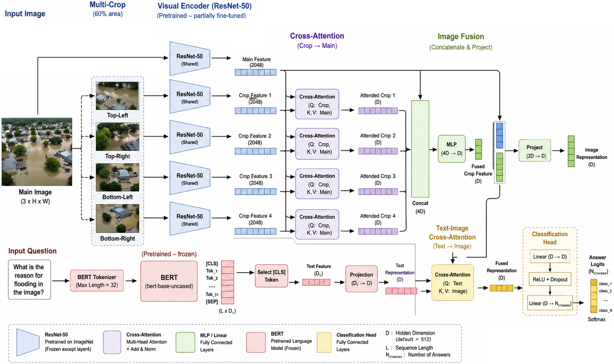
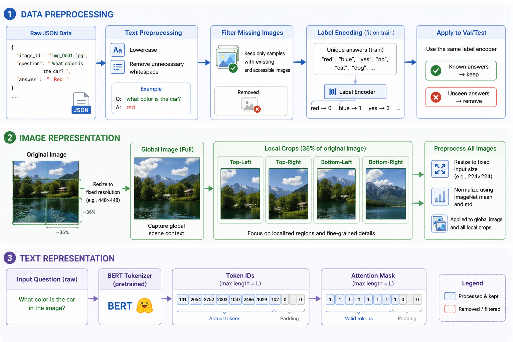

# Multi-Scale Visual Question Answering for Post-Disaster Damage Assessment

## Overview

Rapid understanding of post-disaster aerial imagery is essential for supporting emergency response and damage assessment. However, existing Visual Question Answering (VQA) systems often struggle to jointly capture global scene context and fine-grained local damage patterns in UAV imagery. Models that rely only on global features often miss small but critical details, while patch-based approaches can lose overall spatial context.

To address these challenges, we propose a **multi-scale Vision-Language VQA framework** for post-disaster analysis. The model formulates VQA as a **classification problem over a fixed answer space**, ensuring stable, consistent, and interpretable outputs suitable for high-risk environments.

Our approach integrates:

- Global image representations
- Local region-level crops
- Cross-attention-based feature fusion
- Pretrained vision and language encoders (**ResNet-50 + BERT**)

---

## Model Architecture

### 1. Visual Encoder (ResNet-50 Backbone)

We use a pretrained **ResNet-50** model to extract deep visual features from input images.

- The full image is used to capture global context.
- The final classification layer is removed.
- Features are projected into a shared embedding space using a 1×1 convolution.

---

### 2. Multi-Scale Local Feature Extraction

Each image is divided into **four overlapping crops**:

- Top-left
- Top-right
- Bottom-left
- Bottom-right

Each crop is processed using a **shared-weight ResNet encoder**, ensuring:

- Parameter efficiency
- Consistent feature extraction
- Robust spatial representation

---

### 3. Global–Local Cross-Attention Fusion

Cross-attention is applied to combine global and local features:

- Global features → Key / Value
- Local crop features → Query

This enables each local region to attend to relevant global context for better fine-grained reasoning.

---

### 4. Text Encoder (BERT)

Questions are encoded using a pretrained **BERT** model.

- The `[CLS]` token embedding is used as the sentence representation.
- The embedding is projected into a shared multimodal space.

Example questions:

- "How many buildings are flooded?"
- "What is the condition of the road?"
- "Is the area heavily damaged?"

---

### 5. Vision–Language Fusion

A cross-attention mechanism aligns:

- Text features (Query)
- Visual features (Key / Value)

This enables question-guided visual reasoning.

---

### 6. Classification Head

The fused representation is passed through an MLP classifier.

- Output: probability distribution over predefined answers
- Ensures stable and interpretable predictions

---

## Pipeline

1. Input UAV image  
2. Extract global features using ResNet-50  
3. Split image into four overlapping crops  
4. Encode crops using a shared ResNet encoder  
5. Apply cross-attention (global ↔ local)  
6. Encode question using BERT  
7. Apply cross-attention (text ↔ image)  
8. Fuse multimodal features  
9. Predict answer using the classification head  

---

## Data

We use the **FloodNet dataset**, a UAV-based dataset for flood disaster analysis.

It includes:

- High-resolution aerial images
- Semantic segmentation labels
- Visual Question Answering (VQA) pairs

### Preprocessing

<p align="center">
  
</p>

#### Image preprocessing
- Split each input UAV image into four overlapping local crops:
  - Top-left
  - Top-right
  - Bottom-left
  - Bottom-right
- Resize the original image and all local crops to the encoder input resolution
- Apply image normalization before feature extraction

#### Text preprocessing
- Normalize question text (lowercase, remove extra spaces)
- Encode answer labels using label encoding
- Fit the label encoder only on the training split
- Remove unseen answer classes from validation and test splits

---

## Project Structure

```text
project/
│
├── data/
│   └── readme_data.md
│
├── main.py                 # Vanilla model
├── main_trf_fuse.py        # Global cross-attention model
├── main_multi-branch.py    # Proposed multi-scale model
├── inference.py
├── utils.py
└── README.md
```

---

## Applications

- Post-disaster damage assessment  
- Flood impact analysis  
- Infrastructure monitoring  
- Humanitarian response support  

---

## Baseline Models

We compare against the following baselines:

### Vanilla Concatenation

- Global image features + text concatenation

### Global Cross-Attention

- Global image features + text cross-attention fusion

### Proposed Multi-Scale Model

- Global features + local crops + global-local cross-attention + text-image cross-attention

---

## Key Contributions

- Multi-scale visual representation (global + local crops)
- Cross-attention-based multi-scale feature fusion
- Classification-based VQA formulation for stable predictions
- Improved robustness for UAV-based disaster imagery

---

## How to Use

Follow these steps to set up and run the project:

### 1. Install dependencies

Create a virtual environment (recommended) and install the required packages:

```bash
pip install -r requirements.txt
```

### 2. Download the dataset

Download the **FloodNet dataset** from:

https://www.kaggle.com/datasets/aletbm/aerial-imagery-dataset-floodnet-challenge?select=FloodNet+Challenge+-+Track+2

Then, follow the instructions in `data/readme_data.md` and update the dataset path variables accordingly.

### 3. Run the model

Once the setup is complete, run one of the training scripts depending on the model you want to train and evaluate.

**Vanilla model:**

```bash
python main.py
```

**Global cross-attention model:**

```bash
python main_trf_fuse.py
```

**Proposed multi-scale model:**

```bash
python main_multi-branch.py
```

See the **Baseline Models** section for more details about each model configuration.

---
## Report

https://www.overleaf.com/read/gcygzvjbxvnb#2e51ab
